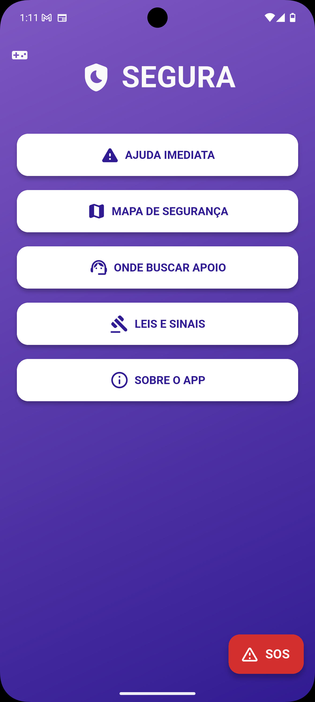
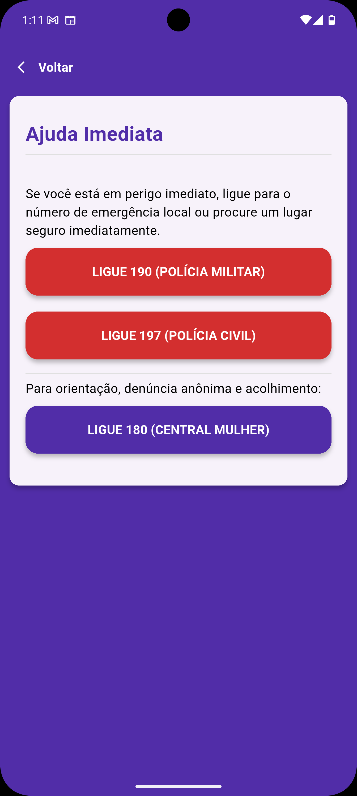
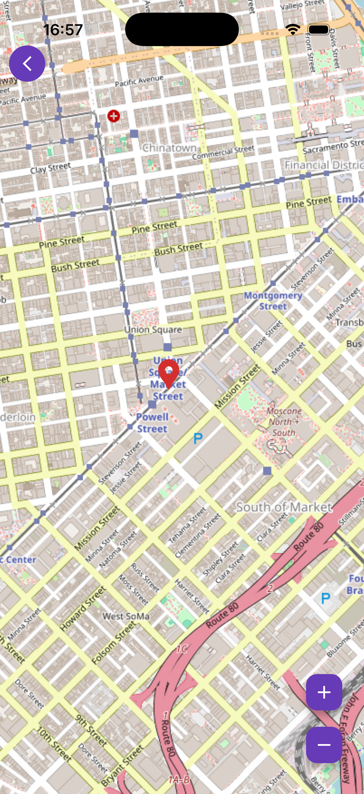
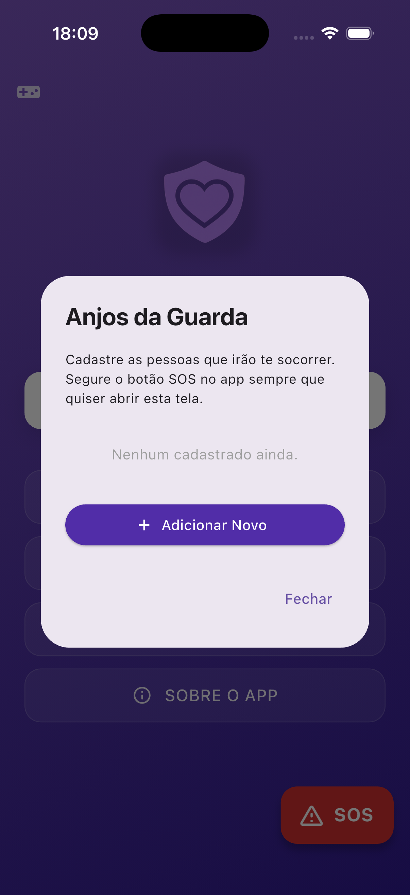
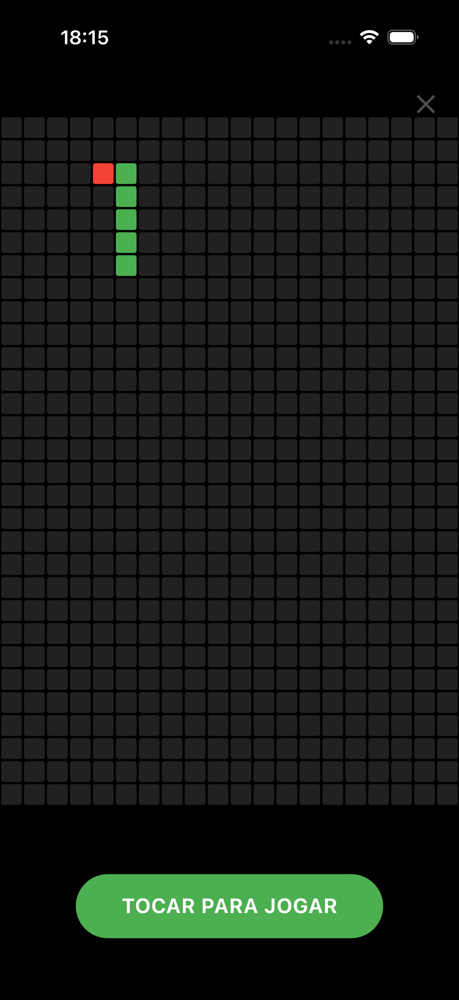

# 🛡️ SEGURA App

  

Um aplicativo focado em oferecer um ambiente **seguro, discreto e acessível**, onde mulheres possam encontrar apoio, conhecer seus direitos e acessar serviços de emergência de forma rápida. O **Segura** foi projetado não apenas com usabilidade em mente, mas atuando sob premissas psicológicas de vítimas de violência, garantindo segurança operacional e invisibilidade quando necessário.

---

## 📸 Demonstração Visual

<p align="center">
  
  
  
  
  
</p>

---

## 💡 Nossos Diferenciais: Funcionalidades Conceituais

### 1. 🚨 Botão SOS Inteligente (Pânico)
A segurança é prioritária. Um botão SOS flutuante acessível em todas as telas permite que a usuária dispare alertas de emergência rapidamente, facilitando o gatilho principal de socorro sob estresse extremo.

### 2. 🎮 Rota de Fuga Silenciosa (Camuflagem)
Em cenários de controle coercitivo (patrimonial/psicológico), o agressor frequentemente vasculha o telefone da vítima. Por isso, a aplicação possui uma **Tela de Camuflagem** inovadora: ao clicar no ícone de "Videogame" nativo no topo, o aplicativo se isola e se transforma instantaneamente num jogo da cobrinha (Snake Game) totalmente funcional. Isso oferece um álibi visual/psicológico perfeito para mascarar a finalidade real do app em momentos de alto risco.

### 3. 📍 Mapa de Segurança Integrado (OpenStreetMap)
Localização em tempo real via satélite/GPS para exibir rotas para DEAMs (Delegacias da Mulher) e centros de apoio (CRAM) próximos à usuária. O carregamento de recursos do mapa ocorre sob demanda, respeitando estritamente a privacidade local.

### 4. 📚 Cartilhas Offline e Suporte Imediato
Disponibilizamos o discador *On-Click* (190, 197, 180) de forma inconfundível (com alto contraste anatômico nos botões vermelhos). Além disso, as cartilhas com leis de proteção (Lei Maria da Penha) e sintomas do ciclo da violência funcionam em formato **100% Offline**, provendo leitura segura em locais sem internet.

---

## 🛠 Arquitetura e Tecnologia (Engenharia S.O.L.I.D)

Visando altíssima manutenibilidade, o projeto escalou para a **Clean Architecture** (Arquitetura Limpa) implementando os princípios fundamentais da Engenharia de Software:
- **Separação de Domínios (SRP):** Seguindo o princípio da _Single Responsibility_, abolimos "God Classes". Textos de apoio, itens de menu e telefones são entidades apartadas em namespaces de dados altamente focados (`lib/constants/*_data.dart`).
- **Roteamento Desacoplado:** Adoção vigorosa de *Named Routes* (`Navigator.pushNamed`). A Interface da Vida (UI) é mantida apenas visual, enquanto o App gerencia o roteamento organicamente no núcleo (`main.dart`).
- **Data Models:** Elementos da visualização (como Ícones e Botões) mapeiam as informações de suas "Entities" abstratas, eliminando lógicas de condicionais verbosas (`switches`) da camada visual.

### **Principais Bibliotecas Utilizadas**
- `url_launcher`: Integração assíncrona com os recursos telefônicos OS e HTTP.
- `flutter_map` e `latlong2`: Malha de mapas de código aberto renderizado *Tile* a *Tile*, sem custos escondidos.
- `geolocator`: Comunicação nativa com o Hardware-Layer do aparelho para GPS/Localização sem armazenar cookies espiões de terceiros.

---

## 🚀 Como testar localmente

Se deseja colaborar ou estudar a arquitetura, clone o projeto e rode o ambiente utilizando os comandos originais do Flutter:

```bash
git clone https://github.com/semellicodes/segura-app-flutter.git
cd segura-app-flutter
flutter clean
flutter pub get
flutter run
```

### 📱 Versão Demo (.APK)
Quer ver como o **Segura** funciona no mundo real? Baixe a nossa versão de testes para o seu Android:
**[Clique aqui para acessar o ZIP/APK disponível nas Releases](https://github.com/semellicodes/segura-app-flutter/releases)**

_(Nota do Desenvolvedor: Aceitar fontes desconhecidas no SO ao instalar o app fora da loja oficial)._
